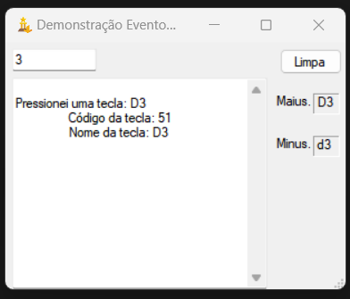

# WindowsFormsC-Alura
Repositório do curso DESENVOLVA APLICAÇÕES WINDOWS FORMS COM C# da Alura

## 1. Componentes e Eventos

### 1.1 Windows Forms com C#: Formulários, componentes e eventos.

Curso introdutório ao Windows Forms com C#.

Principais pontos do curso:

* Comece a construir um aplicativo do Windows Forms
* Utilize componentes como Label, Button e TextBox, e edite suas propriedades
* Conheça os eventos dos componentes, como Click e KeyDown
* Manipule e construa máscaras, inclusive com validações
* Exiba mensagens através do componente MessageBox
* Customize a sua aplicação com ícones e imagens
* Publique a sua aplicação, para outros usuários utilizarem

Foram desenvolvidos alguns formulários, básicos, com o intuito de ser um primeiro contato com a tecnologia.

1.1.1 - Formulário Principal

> Formulário principal represnetando o menu da aplicação.

1.1.2 - Formulário de Demonstração de Tecla

1.1.3 - Formulário HelloWorld

1.1.4 - Formulário definindo máscaras

1.1.5 - Formulário Valida CPF

1.1.6 - Formulário Válida CPF2

> Contém mais validações e caixas de mensagens auxiliares

1.1.7 - Formulário de classificação de senha

